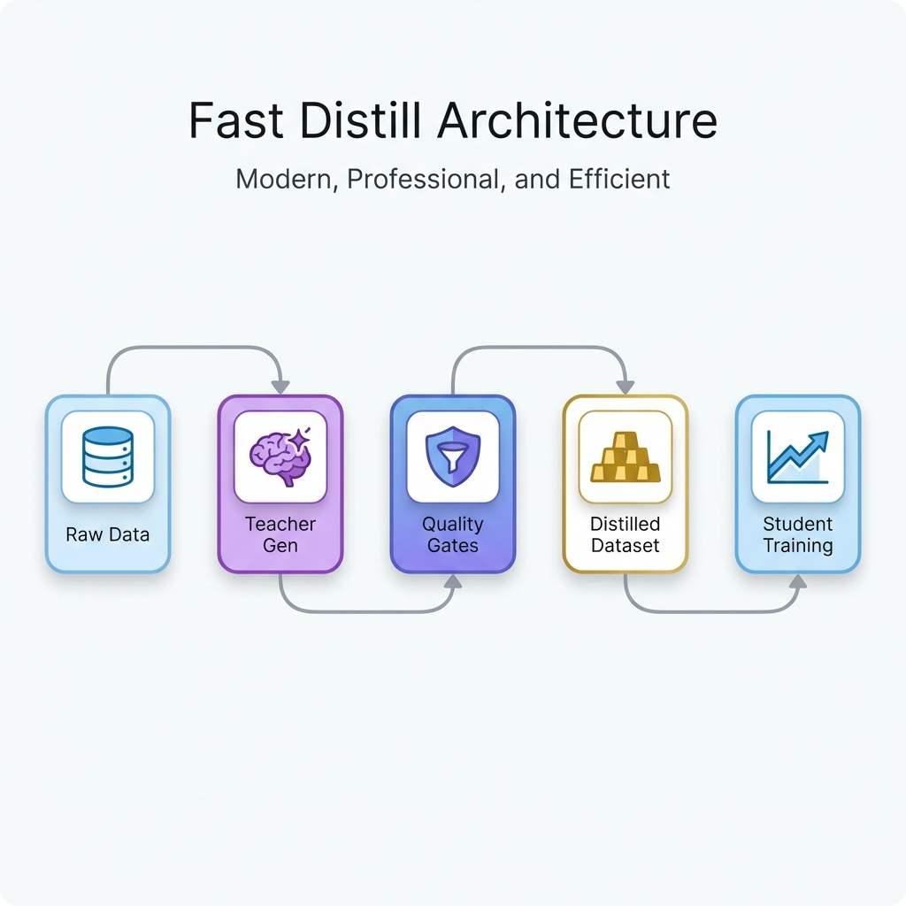

<div align="center">
  
  <h1>Fast Distill</h1>
  <p>
    <strong>High-throughput distillation pipeline with hard quality gates and replayable data contracts.</strong>
  </p>

  <p>
    <a href="LICENSE">
      
    </a>
    <a href="https://www.python.org/">
      
    </a>
    <a href="#">
      
    </a>
  </p>
</div>

<div align="center">
  
</div>

---

## 📊 WikiSQL 1k Distillation Results (2026-01-25)

**Teacher pass rate** and **student performance** from the 1k-sample Text2SQL distillation run (OpenRouter, WikiSQL 1k).  
Source: `docs/sections/fastdistill/baseline.md`

| Stage | Model | Exec pass rate | Gold match rate | Judge score mean |
| :--- | :--- | :--- | :--- | :--- |
| Teacher eval | `deepseek/deepseek-v3.2` | **11.9%** | 6.2% | 0.0905 |
| Student eval (pre) | `Qwen/Qwen3-0.6B` (MLX LoRA) | 53.0% | 0.0% | 0.265 |
| Student eval (post) | `Qwen/Qwen3-0.6B` (MLX LoRA) | **92.9%** | **30.9%** | **0.619** |

> Note: Teacher eval gate was overridden for the full 1k run; keep rate after filtering was 11.9% (119/1000).

---

## 📖 Introduction

**Fast Distill** is a production-grade data distillation framework designed to bridge the gap between raw data potential and high-quality student model training. It orchestrates a unified provider gateway, deterministic data contracts, and rigorous quality gates to produce datasets you can trust.

Unlike simple generation scripts, Fast Distill prioritizes **auditability** and **reproducibility**, ensuring that every sample in your dataset can be traced back to its origin and verified against strict quality standards.

### Key Features

| Feature | Description |
| :--- | :--- |
| **🛡️ Unified Provider Gateway** | Seamless integration with OpenAI-compatible endpoints (vLLM, SGLang, Ollama). |
| **🔒 Deterministic Contracts** | Canonical input + sample ID + manifest ensures full replayability and auditability. |
| **🚦 Hard Quality Gates** | Multi-stage filtering: **Rule-based** (cheap) → **Execution** (deterministic) → **LLM Judge** (nuanced). |
| **📊 Detailed Observability** | Auto-generated per-stage timing and quality reports (`json`) to identify bottlenecks. |
| **⚡ Decoupled Training** | Clean separation between the data generation plane and model training plane. |

---

## 🚀 Quickstart

Get up and running with a local Text2SQL distillation pipeline using Ollama.

### Prerequisites
- Python 3.10+
- [Ollama](https://ollama.com/) running locally (or any OpenAI-compatible server)

### Installation

```bash
# Clone the repository
git clone https://github.com/your-username/fast-distill.git
cd fast-distill

# Create and activate virtual environment
python -m venv .venv
source .venv/bin/activate

# Install with Ollama support
pip install -e ".[ollama]"
```

### Running the Pipeline

Run the end-to-end distillation example with a 0.6B Qwen model:

```bash
# Set your model and run
OLLAMA_MODEL=qwen3:0.6b python examples/fastdistill/ollama_distill_e2e.py
```

### Text2SQL WikiSQL 1k (OpenRouter)
Prepare a 1k Text2SQL dataset sourced from WikiSQL.

```bash
python scripts/prepare_wikisql_1k.py
```

Configure your teacher model in `.env` at repo root:
```bash
OPENROUTER_API_KEY=...
OPENROUTER_MODEL=deepseek/deepseek-v3.2
```

Run the teacher distillation pipeline:
```bash
FASTDISTILL_DATA_PATH=~/.cache/fastdistill/datasets/wikisql/wikisql_1k/train.jsonl \
FASTDISTILL_DB_PATH=~/.cache/fastdistill/datasets/wikisql/wikisql_1k/train.db \
python examples/fastdistill/fastdistill_pipeline.py
```

### Output Artifacts
Your distillation run will generate artifacts in `~/.cache/fastdistill/artifacts/`:
- 📂 `manifests/<stage>/manifest.json` – Precise data lineage.
- 📊 `reports/<stage>/quality_report.json` – Pass rates and rejection stats.
- ⏱️ `reports/timing_report.json` – Latency breakdown per stage.

---

## 📐 Architecture & Design

The pipeline flows from raw data to a distilled dataset through a series of rigorous checks.

**End-to-End Information Flow:**
1.  **Ingest & Canonicalize**: Normailize raw inputs into a stable schema.
2.  **Dedup**: Compute hashes to avoid redundant processing.
3.  **Teacher Gen**: Generate candidates using a high-quality Teacher LLM.
4.  **Quality Gates**:
    *   **Rule Filter**: Fast checks (format, length).
    *   **Exec Eval**: Run code/SQL in a sandbox to verify correctness.
    *   **Judge**: LLM-based scoring for semantic quality.
5.  **Selection**: Filter-pass candidates are exported to the Student Dataset.

📚 **Learn more:**
- [Architecture Deep Dive](docs/sections/fastdistill/architecture.md)
- [Baseline Benchmarks](docs/sections/fastdistill/baseline.md)

---

## 💡 Planning & Cost Estimation

### 0.6B distillation estimate (Text2SQL, 1k samples)
Measured on `scripts/run_ollama_mlx_e2e.py` with `qwen3:0.6b` teacher + MLX LoRA:
- Distillation time: 20.930s for 2 samples → **~2.91 hours for 1k samples** (linear extrapolation).
- MLX training time: **60.187s** for 1k iters (smoke-test config, 2-sample dataset).
- Token estimate (toy prompts): ~21 input / ~8 output tokens per sample (4 chars/token heuristic).

Teacher API cost for 1k samples (DeepSeek V3.2):

| Source | Input $/1M | Output $/1M | Est. teacher cost |
| --- | --- | --- | --- |
| DeepSeek official pricing | 0.28 (cache miss) | 0.42 | ~$0.009 |
| OpenRouter pricing (portkey) | 0.27 | 0.40 | ~$0.009 |

> **Note**: Replace with real token counts + throughput from your pilot runs.

---

## 📚 Documentation & Examples

- **Integrations**:
    - [SGLang Integration](docs/sections/fastdistill/sglang.md)
    - [MLX Local Training](docs/sections/fastdistill/mlx.md)
- **Configuration**:
    - [Run Config](configs/fastdistill/run_config.sample.yaml)
    - [Quality Gates](configs/fastdistill/quality_gates.sample.yaml)
- **Reference**:
    - [Text2SQL Pipeline Code](examples/fastdistill/fastdistill_pipeline.py)
- [Performance Analysis](docs/sections/fastdistill/performance.md)
- [Teacher-Student Alignment](docs/sections/fastdistill/quality_alignment.md)
- [WikiSQL 1k Runbook](docs/sections/fastdistill/text2sql_wikisql.md)

---

## 🧪 Testing

Ensure the pipeline integrity by running the unit tests:

```bash
pytest tests/unit/steps/fastdistill/test_fastdistill_steps.py
```

---

## ⚖️ License

This project is licensed under the **MIT License**.
