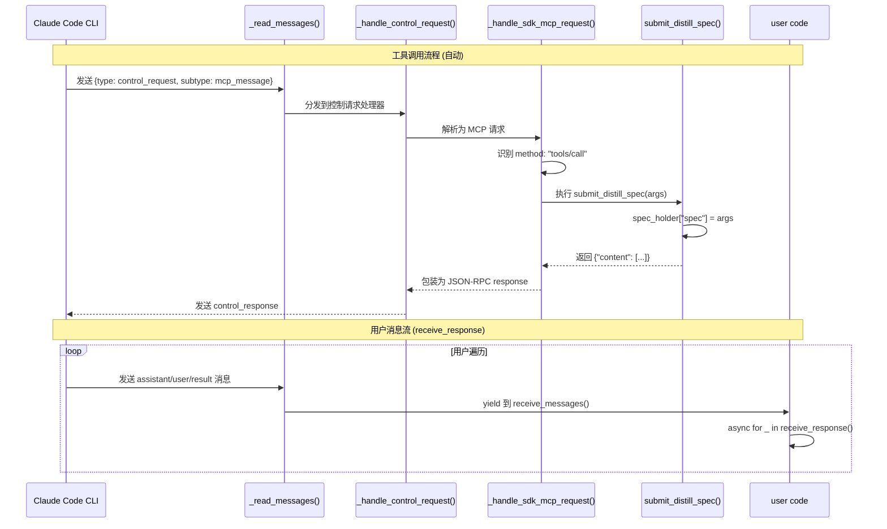

# Agent 工具调用流程 (ACP 规范)

## 1. 协议概览

```yaml
Protocol: Agent Communication Protocol (ACP)
Version: 0.1.23 (claude-agent-sdk)
Transport: JSON-RPC over stdin/stdout (Subprocess)
Channels:
  - control: 工具调用、权限请求、MCP 消息 (自动处理)
  - message: 用户可见消息流 (receive_response)
```

---

## 2. 双通道架构

```
┌─────────────────────────────────────────────────────────────┐
│                    Claude Code CLI 子进程                    │
│  ┌─────────────────┐          ┌─────────────────────────┐   │
│  │  control 通道   │          │      message 通道       │   │
│  │  (JSON-RPC)     │          │  (User/Assistant msg)   │   │
│  └────────┬────────┘          └───────────┬─────────────┘   │
└───────────┼───────────────────────────────┼─────────────────┘
            │                               │
            │ stdin/stdout                  │
            ▼                               ▼
┌─────────────────────────────────────────────────────────────┐
│                    Python SDK (Query 类)                     │
│  ┌──────────────────────────┐  ┌─────────────────────────┐  │
│  │  _read_messages()        │  │  receive_messages()     │  │
│  │  ├─ control_request →    │  │  └→ receive_response()  │  │
│  │  │   _handle_control_    │  │       (用户遍历)         │  │
│  │  │   request()           │  │                         │  │
│  │  │                       │  │                         │  │
│  │  └─ regular msg →        │  │                         │  │
│  │      _message_send       │  │                         │  │
│  └──────────────────────────┘  └─────────────────────────┘  │
└─────────────────────────────────────────────────────────────┘
```

---

## 3. 消息类型矩阵

| 类型 | 通道 | 处理方 | 说明 |
|------|------|--------|------|
| `control_request` | control | SDK 自动 | 工具调用、权限请求、Hook |
| `control_response` | control | SDK 自动 | 控制请求的响应 |
| `user` | message | 用户接收 | 用户输入消息 |
| `assistant` | message | 用户接收 | Claude 回复消息 |
| `result` | message | 用户接收 | 会话结束标记 |

---

## 4. 工具调用时序图



---

## 5. 关键代码解析

### 5.1 消息路由 (query.py:167-209)

```python
async def _read_messages(self):
    async for message in self.transport.read_messages():
        msg_type = message.get("type")

        # 通道 1: control 消息 (自动处理)
        if msg_type == "control_request":
            # 后台自动分发，用户无感知
            self._tg.start_soon(self._handle_control_request, request)
            continue

        # 通道 2: 普通消息 (流入 receive_messages)
        await self._message_send.send(message)  # 用户可接收
```

### 5.2 工具调用处理 (query.py:466-498)

```python
async def _handle_sdk_mcp_request(server_name, message):
    method = message.get("method")

    if method == "tools/call":
        call_request = CallToolRequest(...)
        handler = server.request_handlers.get(CallToolRequest)
        result = await handler(call_request)  # 执行用户定义的 @tool 函数

        return {
            "jsonrpc": "2.0",
            "id": message.get("id"),
            "result": {"content": [...]}
        }
```

### 5.3 用户代码侧 (claude.py:109-116)

```python
async with ClaudeSDKClient(options=options) as client:
    await client.query(prompt)

    # 仅消费 message 通道，不处理 control 通道
    async for _ in client.receive_response():
        pass  # 工具调用在后台自动完成

# 工具执行结果已存储在 spec_holder
spec = DistillAgentSpec.model_validate(spec_holder["spec"])
```

---

## 6. 设计要点

### 6.1 为什么 `async for _ in ...: pass` 可以工作

| 问题 | 解答 |
|------|------|
| 工具调用在哪里处理？ | 在 `control_request` 通道，由 SDK 后台自动处理 |
| 用户遍历的作用？ | 仅消费 `message` 通道，维持连接直到 `ResultMessage` |
| 如果省略遍历会怎样？ | 连接可能提前关闭，导致工具调用未完成 |

### 6.2 两个通道的独立性

```
control 通道 (自动)
├── 工具调用 (tools/call)
├── 权限请求 (can_use_tool)
├── Hook 回调 (hook_callback)
└── MCP 消息 (mcp_message)
    └── 全部自动处理，用户代码无感知

message 通道 (用户遍历)
├── user
├── assistant
└── result
    └── 通过 receive_response() 暴露给用户
```

---

## 7. 状态验证

```python
# 工具执行完成后的状态检查
assert "spec" in spec_holder, "工具未被调用"
assert isinstance(spec_holder["spec"], dict), "工具返回格式错误"
```

---

## 8. 调试建议

如需观察实际流量，在 `claude.py` 添加：

```python
async for response in client.receive_response():
    # 仅显示 message 通道内容
    print(f"[MSG] {response}")
```

如需观察 control 通道，需修改 SDK (`query.py:191`)：

```python
elif msg_type == "control_request":
    print(f"[CTRL] {message}")  # 添加日志
    self._tg.start_soon(self._handle_control_request, request)
```
