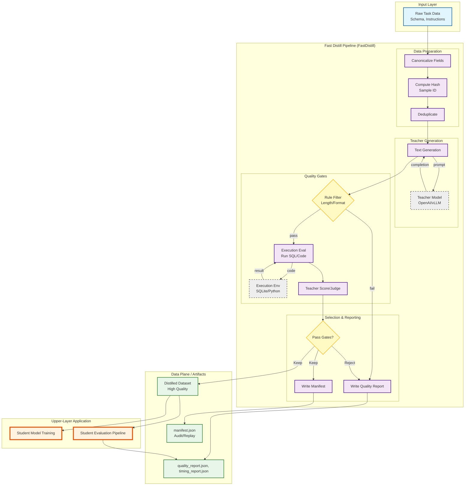

# FastDistill Architecture

## Goals and hard constraints
- Maximize teacher throughput without lowering the quality floor.
- Make quality gates falsifiable (exec/judge) and replayable.
- Keep training outside the data-generation path to avoid provider lock-in.

## End-to-end flow (current reference pipeline)


## Module architecture (data/control/observability)
```mermaid
flowchart LR
  subgraph ControlPlane["Control plane"]
    Orchestrator[Pipeline Orchestrator]
    Policy[Quality/Cost Policy]
    Registry[Artifact Registry]
  end

  subgraph DataPlane["Data plane"]
    Ingest[Ingest + Canonicalize]
    Gen[Teacher Generation]
    Gates[Quality Gates]
    Distill[Distilled Export]
    StudentEval[Student Eval]
  end

  subgraph ModelPlane["Model plane"]
    Trainer[Training (external)]
  end

  subgraph Providers["Provider adapters"]
    OpenAI[OpenAI-compatible]
    SGLang[SGLangLLM]
    Ollama[Ollama]
  end

  subgraph Observability["Observability"]
    Manifest[Manifest]
    Quality[Quality Report]
    Timing[Timing Report]
  end

  Orchestrator --> Ingest
  Policy --> Gates
  Ingest --> Gen --> Gates --> Distill --> StudentEval --> Trainer
  Providers --> Gen
  Distill --> Registry
  StudentEval --> Registry
  Ingest -.-> Manifest
  Gates -.-> Quality
  StudentEval -.-> Quality
  Ingest -.-> Timing
  Gen -.-> Timing
  StudentEval -.-> Timing
```

### Module responsibilities
- **Control plane**: run configuration, scheduling, budget/quality policy, artifact versioning.
- **Data plane**: canonicalization, generation, gates, distilled export, student eval.
- **Model plane**: training lives outside the pipeline; consumes distilled outputs.
- **Provider adapters**: OpenAI-compatible providers, SGLang, Ollama; swappable at runtime.
- **Observability**: manifests + quality/timing reports; no mutations to data flow.

## Data contract
- `canonical_input`: stable JSON string from selected fields.
- `sample_id`: sha256 over `task_id + canonical_input` (reference pipeline).
- Optional fields for production runs: `schema_hash` and `decode_profile`.
- Artifacts are partitioned by stage and run_id to keep replayability.

## Analysis / observability tools
These are the first-class analysis tools in the fastdistill steps:

1. **Manifest** (`WriteManifest`)
   - Output: `manifest.json` per stage.
   - Fields: `count`, `field_hash`, `min_sample_id`, `max_sample_id`, `columns`.
   - Purpose: replayability + data auditing.
   - Reference pipeline writes the manifest at the `distilled` stage.

2. **Quality report** (`WriteQualityReport`)
   - Output: `quality_report.json` per stage.
   - Fields: `kept`, `rejected`, `p_keep`, `exec_pass_rate`, `gold_match_rate`,
     `judge_score` stats, `reject_reason_counts`, `exec_error_counts`.
   - Purpose: quantify quality gates and failure modes.
   - Reference pipeline emits:
     - `stage=distilled` (teacher_score + exec/gold match)
     - `stage=student_eval` (student_score + exec/gold match)

3. **Timing report** (`WriteTimingReport` + `MarkTime`)
   - Output: `timing_report.json`.
   - Fields: per-stage deltas with `p50/p90/p95`, plus total duration.
   - Purpose: find latency hotspots and compute throughput metrics.
   - Labels in the reference pipeline: `raw`, `canonical`, `hashed`, `teacher`,
     `filtered`, `eval`, `selected`, `distilled`, `student_gen`, `student_eval`.

4. **SQL exec eval** (`SQLiteExecEval`)
   - Fields: `exec_pass`, `exec_error`, `gold_match`, `result_signature`.
   - Purpose: deterministic pass/fail for Text2SQL.

5. **LLM token statistics**
   - Available in `fastdistill_metadata.statistics_<step_name>`.
   - Use to compute `teacher_tokens_per_sec` and cost per sample.
   - For student generation, use `statistics_text_generation_1`.

## Metrics derived from reports
- `teacher_tokens_per_sec` = sum(output_tokens) / teacher_duration_seconds
- `pipeline_kept_samples_per_hour` = kept / (total_duration_seconds / 3600)
- `student_tokens_per_sec` = sum(output_tokens) / student_gen_duration_seconds

## Codebase implementation map
- `fastdistill/pipeline`: DAG, batch manager, execution engines (local/ray), cache, step wrappers.
- `fastdistill/steps`: core step primitives + step library (columns/formatting/filtering/tasks).
- `fastdistill/models`: LLM/embeddings/image providers + base clients and mixins.
- `fastdistill/registry`: component registry + entry-point discovery for plugins.
- `fastdistill/providers`: provider adapter envelopes + protocol interfaces (LLM/embeddings/image).
- `fastdistill/distiset.py`: dataset packaging, hub push, artifact bundling.
- `fastdistill/mixins`, `fastdistill/typing`, `fastdistill/utils`: runtime parameters, typing, serialization, logging.

## Refactor priorities (OSS-grade)
1. Optional dependency isolation: keep provider/step imports lazy to avoid hard failures on missing extras.
2. Public API surface: stable imports at `fastdistill` + focused subpackages; deprecated shims stay thin.
3. Engine vs library separation: isolate pipeline runtime from step/task libraries and templates.
4. Config and error boundaries: YAML-first configs + clear error hierarchy for user vs system issues.
5. Test strategy: unit tests for core engine + explicit integration tests per provider extra.

## Performance optimization points
**Teacher generation**
- Increase `input_batch_size` and provider-side batch support.
- Use decode profiles (temperature/top_p/n) to trade diversity vs cost.
- Cache/dedup with `sample_id` to avoid repeat generations (e.g. `DeduplicateByField`).

**Student generation**
- Treat as a separate throughput budget; run on cheaper models if possible.
- Keep student prompts minimal (schema + instruction) to reduce latency.

**Quality gates**
- Put cheap rules first (length/format) before exec/judge.
- Short-circuit on exec failure; skip judge for failures.
- Run judge in a separate queue with strict concurrency caps.
- Prefer streaming filters (e.g. `FilterByBool`) to avoid global-step barriers.

**Data plane**
- Partition artifacts by `run_id` and `stage`.
- Keep manifests per shard to avoid full scans.
- Use parquet for large stages; keep JSON only for reports.

**Control plane**
- Apply backpressure based on provider token budget.
- Use `load_groups` to control step concurrency and memory.
- Prefer sequential execution for large global steps (manifest/report).

**Student eval**
- Keep eval isolated from generation artifacts; only read distilled outputs.
- Track exec error distributions to drive targeted fixes.

## Entry points
- Reference pipeline (Python): `examples/fastdistill/fastdistill_pipeline.py`
- Reference pipeline (YAML): `examples/fastdistill/fastdistill_pipeline.yaml`
- E2E demo with eval + timing: `examples/fastdistill/ollama_distill_e2e.py`
