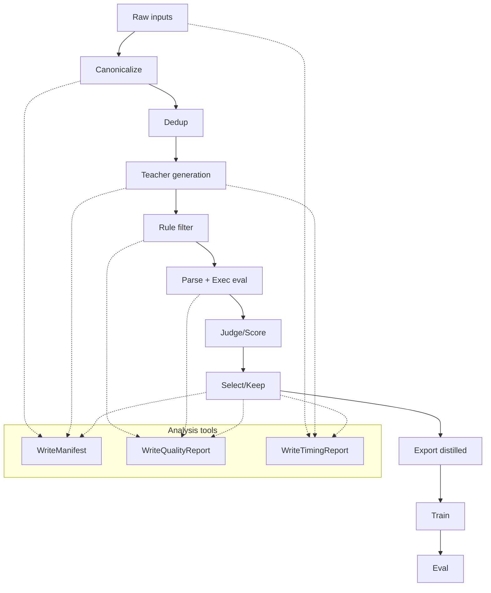

# FastDistill Architecture

## Goals and hard constraints
- Maximize teacher throughput without lowering the quality floor.
- Make quality gates falsifiable (exec/judge) and replayable.
- Decouple training from data generation to avoid provider lock-in.

## End-to-end flow (design)

## Data contract
- `canonical_input`: stable JSON string from selected fields.
- `sample_id`: sha256 over `task_id + schema_hash + canonical_input + decode_profile`.
- `schema_hash`: sha256 over `schema`.
- Artifacts are partitioned by stage and run_id to keep replayability.

## Analysis / observability tools
These are the first-class analysis tools in the fastdistill steps:

1. **Manifest** (`WriteManifest`)
   - Output: `manifest.json` per stage.
   - Fields: `count`, `field_hash`, `min_sample_id`, `max_sample_id`, `columns`.
   - Purpose: replayability + data auditing.

2. **Quality report** (`WriteQualityReport`)
   - Output: `quality_report.json` per stage.
   - Fields: `kept`, `rejected`, `p_keep`, `exec_pass_rate`, `gold_match_rate`,
     `judge_score` stats, `reject_reason_counts`, `exec_error_counts`.
   - Purpose: quantify quality gates and failure modes.

3. **Timing report** (`WriteTimingReport` + `MarkTime`)
   - Output: `timing_report.json`.
   - Fields: per-stage deltas with `p50/p90/p95`, plus total duration.
   - Purpose: find latency hotspots and compute throughput metrics.

4. **SQL exec eval** (`SQLiteExecEval`)
   - Fields: `exec_pass`, `exec_error`, `gold_match`, `result_signature`.
   - Purpose: deterministic pass/fail for Text2SQL.

5. **LLM token statistics**
   - Available in `distilabel_metadata.statistics_<step_name>`.
   - Use to compute `teacher_tokens_per_sec` and cost per sample.

## Metrics derived from reports
- `teacher_tokens_per_sec` = sum(output_tokens) / teacher_duration_seconds
- `pipeline_kept_samples_per_hour` = kept / (total_duration_seconds / 3600)
- `train_tokens_per_sec` = training tokens / training wall time

## Performance optimization points
**Teacher generation**
- Increase `input_batch_size` and provider-side batch support.
- Use decode profiles (temperature/top_p/n) to trade diversity vs cost.
- Cache/dedup with `sample_id` to avoid repeat generations (e.g. `DeduplicateByField`).

**Quality gates**
- Put cheap rules first (length/format) before exec/judge.
- Short-circuit on exec failure; skip judge for failures.
- Run judge in a separate queue with strict concurrency caps.
- Prefer streaming filters (e.g. `FilterByBool`) to avoid global-step barriers.

**Data plane**
- Partition artifacts by `run_id` and `stage`.
- Keep manifests per shard to avoid full scans.
- Use parquet for large stages; keep JSON only for reports.

**Control plane**
- Apply backpressure based on provider token budget.
- Use `load_groups` to control step concurrency and memory.
- Prefer sequential execution for large global steps (manifest/report).

**Eval + training**
- Keep eval isolated from generation artifacts; only read distilled outputs.
- Track exec error distributions to drive targeted fixes.

## Entry points
- Reference pipeline (Python): `examples/fastdistill/fastdistill_pipeline.py`
- Reference pipeline (YAML): `examples/fastdistill/fastdistill_pipeline.yaml`
- E2E demo with eval + timing: `examples/fastdistill/ollama_distill_e2e.py`
