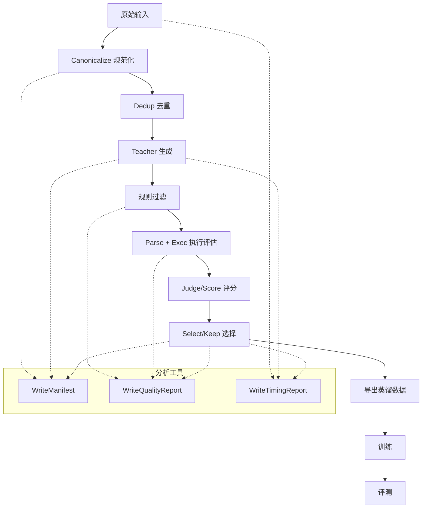

# FastDistill 架构与全链路设计

## 目标与硬约束
- Teacher 侧吞吐最大化，质量下限不下降。
- 质量闸门可复核、可反驳（exec/judge）。
- 训练与数据生成解耦，避免供应商绑定。

## 全链路流程图

## 数据合同
- `canonical_input`: 对关键字段做稳定 JSON 序列化。
- `sample_id`: sha256(`task_id + schema_hash + canonical_input + decode_profile`)。
- `schema_hash`: sha256(`schema`)。
- 产物按 `run_id` 与 `stage` 分区，保证可重放。

## 分析/观测工具（好事分析工具）
1. **Manifest** (`WriteManifest`)
   - 输出：每个 stage 的 `manifest.json`。
   - 字段：`count`, `field_hash`, `min_sample_id`, `max_sample_id`, `columns`。
   - 作用：数据审计 + 可重放。

2. **质量报告** (`WriteQualityReport`)
   - 输出：每个 stage 的 `quality_report.json`。
   - 字段：`kept`, `rejected`, `p_keep`, `exec_pass_rate`, `gold_match_rate`,
     `judge_score` 统计, `reject_reason_counts`, `exec_error_counts`。
   - 作用：量化质量闸门与失败分布。

3. **耗时报告** (`WriteTimingReport` + `MarkTime`)
   - 输出：`timing_report.json`。
   - 字段：分段耗时 `p50/p90/p95` + total。
   - 作用：定位性能瓶颈。

4. **SQL 执行评估** (`SQLiteExecEval`)
   - 字段：`exec_pass`, `exec_error`, `gold_match`, `result_signature`。
   - 作用：Text2SQL 的确定性验收。

5. **LLM 统计**
   - 位于 `distilabel_metadata.statistics_<step_name>`。
   - 用于计算 `teacher_tokens_per_sec` 与成本/样本。

## 指标计算
- `teacher_tokens_per_sec` = sum(output_tokens) / teacher_duration_seconds
- `pipeline_kept_samples_per_hour` = kept / (total_duration_seconds / 3600)
- `train_tokens_per_sec` = training tokens / training wall time

## 可性能优化的点
**Teacher 生成**
- 提升 `input_batch_size` 与 provider 端批处理能力。
- 用 decode profile 控制多样性与成本（temperature/top_p/n）。
- 通过 `sample_id` 做去重/缓存，避免重复调用。

**质量闸门**
- 先做低成本规则过滤，再做 exec/judge。
- exec 失败直接短路，避免无意义 judge。
- judge 单独队列，严格限制并发。

**数据面**
- 产物按 `run_id` + `stage` 分区。
- 大规模阶段使用 parquet；报告保留 JSON。
- manifest 按 shard 写入，避免全量扫描。

**控制面**
- 根据 provider token budget 做背压。
- `load_groups` 控制并发与内存峰值。
- global step（manifest/report）建议串行执行。

**训练/评测**
- 训练只读取 distilled 数据，不耦合生成产物。
- 持续追踪 exec_error 分布，驱动定向优化。

## 入口
- Python 参考管线：`examples/fastdistill/fastdistill_pipeline.py`
- YAML 参考管线：`examples/fastdistill/fastdistill_pipeline.yaml`
- E2E 示例：`examples/fastdistill/ollama_distill_e2e.py`
