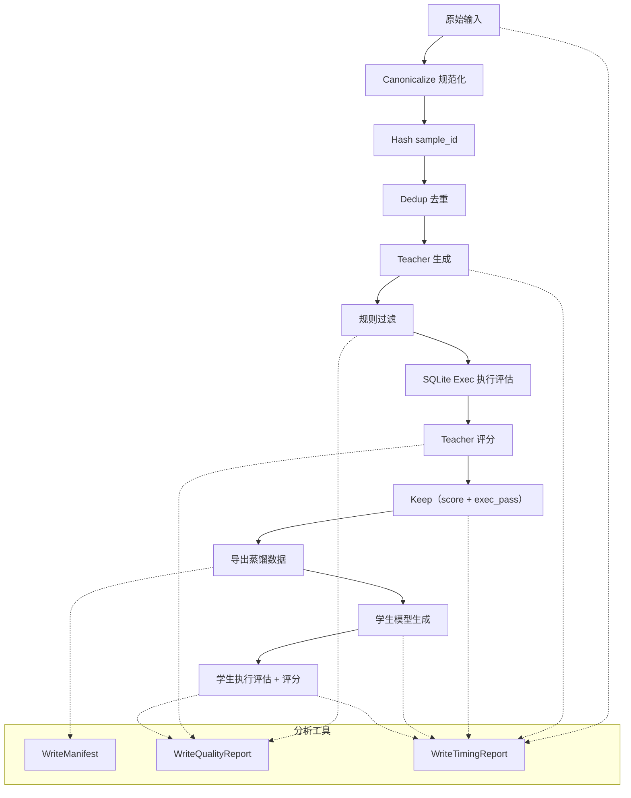
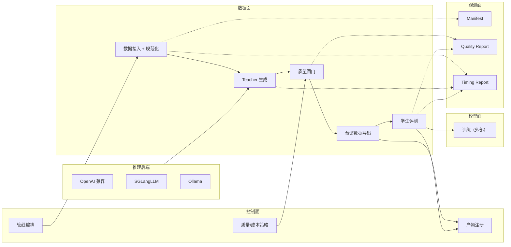

# FastDistill 架构与全链路设计

## 目标与硬约束
- Teacher 侧吞吐最大化，质量下限不下降。
- 质量闸门可复核、可反驳（exec/judge）。
- 训练与数据生成路径解耦，避免供应商绑定。

## 全链路流程图（当前参考管线）

## 模块化架构（数据面 / 控制面 / 观测面）

### 模块职责
- **控制面**：运行配置、调度、成本/质量策略、产物版本管理。
- **数据面**：规范化、生成、闸门、蒸馏导出、学生评测。
- **模型面**：训练在管线之外执行，仅消费蒸馏数据。
- **推理后端**：OpenAI 兼容、SGLang、Ollama 等可热插拔。
- **观测面**：manifest/质量/耗时报告，仅观测不改写数据流。

## 数据合同
- `canonical_input`: 对关键字段做稳定 JSON 序列化。
- `sample_id`: sha256(`task_id + canonical_input`)（参考管线）。
- 生产使用可额外加入 `schema_hash`、`decode_profile`。
- 产物按 `run_id` 与 `stage` 分区，保证可重放。

## 分析/观测工具（好事分析工具）
1. **Manifest** (`WriteManifest`)
   - 输出：每个 stage 的 `manifest.json`。
   - 字段：`count`, `field_hash`, `min_sample_id`, `max_sample_id`, `columns`。
   - 作用：数据审计 + 可重放。
   - 参考管线在 `distilled` stage 写入 manifest。

2. **质量报告** (`WriteQualityReport`)
   - 输出：每个 stage 的 `quality_report.json`。
   - 字段：`kept`, `rejected`, `p_keep`, `exec_pass_rate`, `gold_match_rate`,
     `judge_score` 统计, `reject_reason_counts`, `exec_error_counts`。
   - 作用：量化质量闸门与失败分布。
   - 参考管线输出：
     - `stage=distilled`（teacher_score + exec/gold match）
     - `stage=student_eval`（student_score + exec/gold match）

3. **耗时报告** (`WriteTimingReport` + `MarkTime`)
   - 输出：`timing_report.json`。
   - 字段：分段耗时 `p50/p90/p95` + total。
   - 作用：定位性能瓶颈。
   - 参考管线标签：`raw`, `canonical`, `hashed`, `teacher`,
     `filtered`, `eval`, `selected`, `distilled`, `student_gen`, `student_eval`。

4. **SQL 执行评估** (`SQLiteExecEval`)
   - 字段：`exec_pass`, `exec_error`, `gold_match`, `result_signature`。
   - 作用：Text2SQL 的确定性验收。

5. **LLM 统计**
   - 位于 `distilabel_metadata.statistics_<step_name>`。
   - 用于计算 `teacher_tokens_per_sec` 与成本/样本。
   - 学生侧统计使用 `statistics_text_generation_1`。

## 指标计算
- `teacher_tokens_per_sec` = sum(output_tokens) / teacher_duration_seconds
- `pipeline_kept_samples_per_hour` = kept / (total_duration_seconds / 3600)
- `student_tokens_per_sec` = sum(output_tokens) / student_gen_duration_seconds

## 可性能优化的点
**Teacher 生成**
- 提升 `input_batch_size` 与 provider 端批处理能力。
- 用 decode profile 控制多样性与成本（temperature/top_p/n）。
- 通过 `sample_id` 做去重/缓存，避免重复调用（例如 `DeduplicateByField`）。

**学生生成**
- 单独预算吞吐，尽量使用更小/更快的学生模型。
- prompt 保持最小化（schema + instruction），降低延迟。

**质量闸门**
- 先做低成本规则过滤，再做 exec/judge。
- exec 失败直接短路，避免无意义 judge。
- judge 单独队列，严格限制并发。
- 简单过滤优先用流式 step（如 `FilterByBool`），避免全局步骤阻塞。

**数据面**
- 产物按 `run_id` + `stage` 分区。
- 大规模阶段使用 parquet；报告保留 JSON。
- manifest 按 shard 写入，避免全量扫描。

**控制面**
- 根据 provider token budget 做背压。
- `load_groups` 控制并发与内存峰值。
- global step（manifest/report）建议串行执行。

**学生评测**
- 评测只读取 distilled 数据，不耦合生成产物。
- 持续追踪 exec_error 分布，驱动定向优化。

## 入口
- Python 参考管线：`examples/fastdistill/fastdistill_pipeline.py`
- YAML 参考管线：`examples/fastdistill/fastdistill_pipeline.yaml`
- E2E 示例：`examples/fastdistill/ollama_distill_e2e.py`
